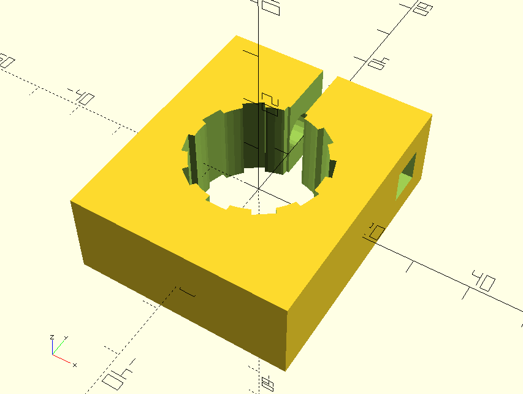
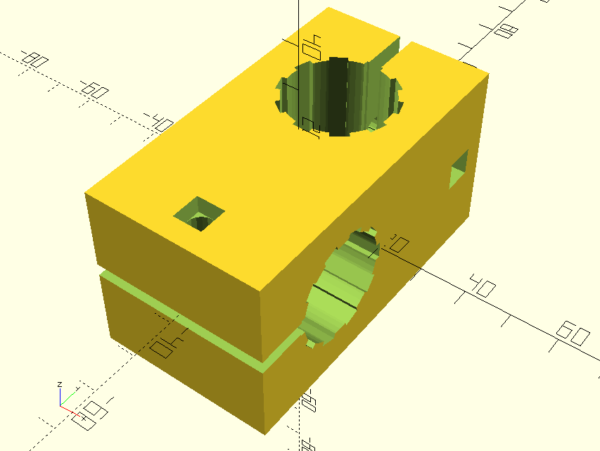
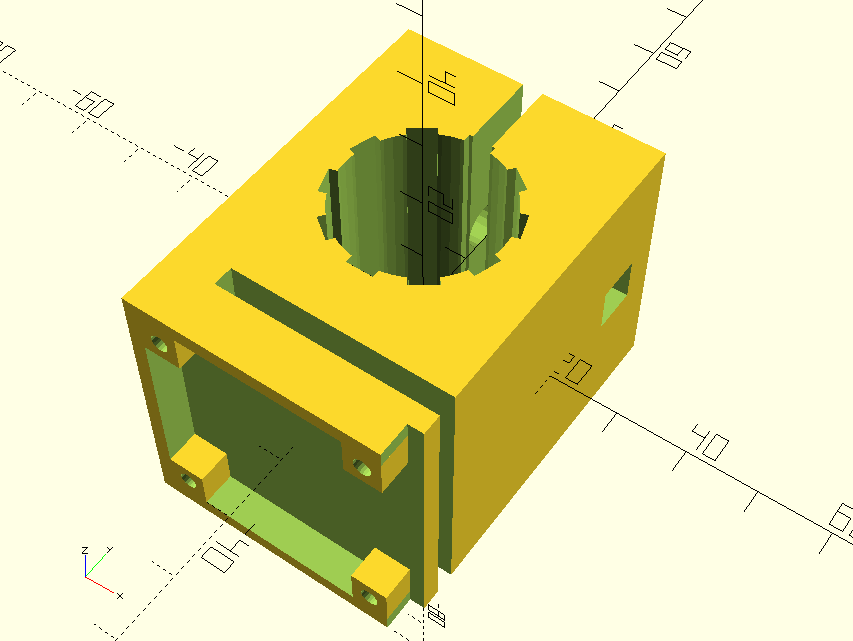
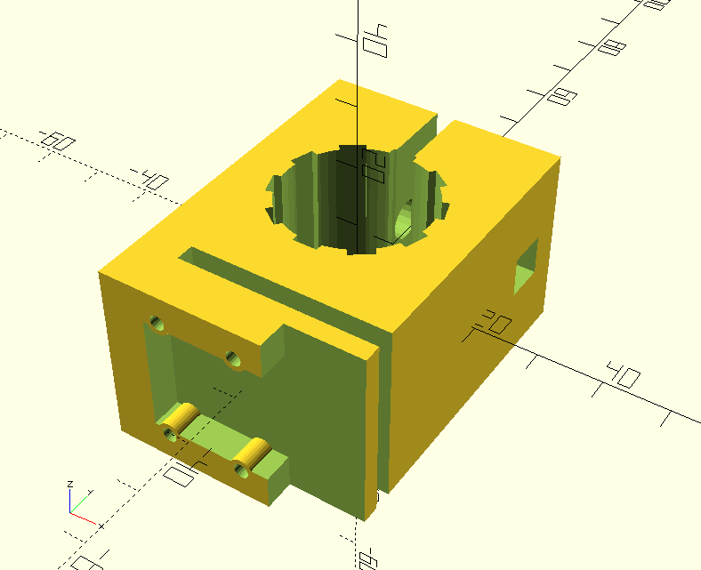
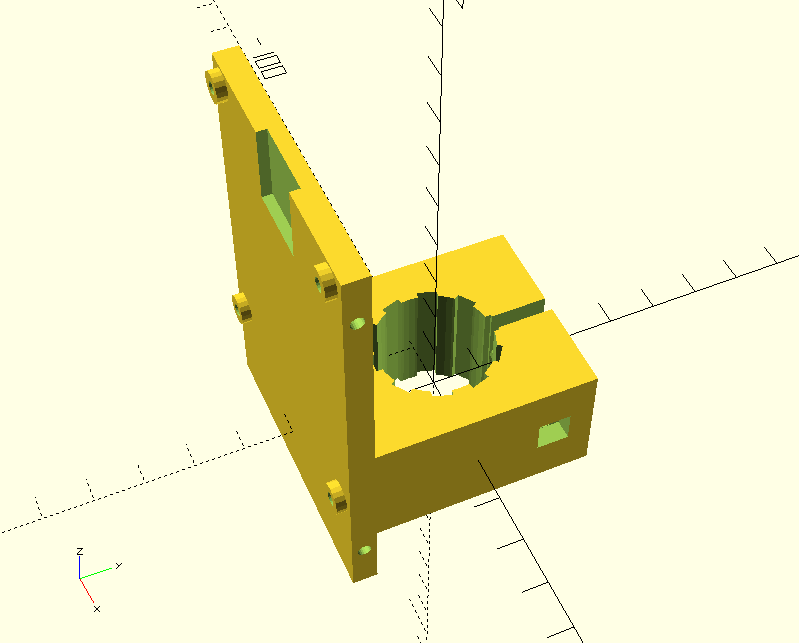

# camera-boom
3D printable crossblocks and related items used to build a boom using 3/4" conduit 
with mounting blocks for a Raspberry PI and cameras.

## Files:
* [lib](lib) Library of reused modules
* [collet.scad](collet.scad) - Collet For Holding A Counterweight
* [crossblock.scad](crossblock.scad) crossblock.scad - Crossblock
* [piblock.scad](piblock.scad) - PI B Mounting Block
* [v1block.scad](v1block.scad) - PI Camera V1 Mounting Block
* [hqblock.scad](hqblock.scad) - PI HQ Camera Mounting Block
* [mountblock.scad](mountblock.scad) - Mount a swinging boom to hoprizontal surface with a 1/4" lag screw

## How To Build STL Files 

On a Linux/Unix system with Make and OpenSCAD installed, download this repo and type `make`
in the top-level directory.

If this is not viable for some reason and you don't have any reason to change the design,
then you can use the .stl files I placed in the [stl](stl) directory.

## Printing Notes

I used slic3r to render the gcode files with these parameters:

* Nozzle = .5mm
* Layer Height = .4mm
* Infill = 30% Honeycomb
* Overhang threshold = 10% 
* Contact Z-distance = .2mm (easily detached)
* Bed Temperature = 80C
* Nozzle Temperature = 235C

I printed using a TAZ5 with 3mm Black ESUN (cheap) filament and pried the parts
off the bed using a razor blade.

## Assembly Instructions

Use 1/4" [carriage bolts](https://en.wikipedia.org/wiki/Carriage_bolt) 
with a wingnut and washer to clamp blocks to 3/4" conduit pipes cut to whatever 
length is suitable for your application. 
2" carriage bolts bolts should suffice for the default design files.

If you expect to support more than 15 pounds (7 Kg) or so, you might want to
increase the thickness of your crossblocks (the joints hanging your boom
and balancing the counterweight carry the vast majority of the load.) 
To do this, change the `block_inset` value in the `crossblock.scad` file
to a larger number... like 20 or 30.  (Note: I put a crossblock30.stl file
into the stl directory in case you don't have OpenSCAD installed. 
Probably need to use 2 1/2" carriage bolts for this larger block.)

## Collet

## Crossblock

## HQ Camera Block

## V1 Camera Block

## PI Mounting Block

